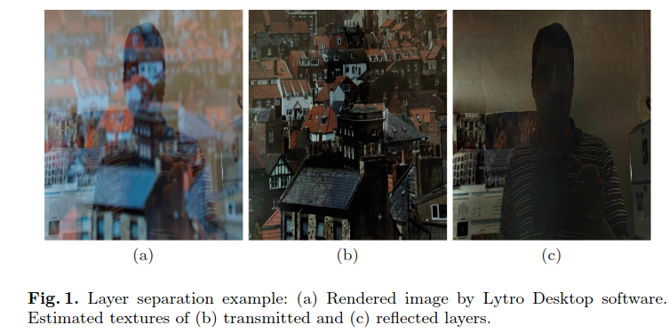

{{ page.authors }}

## Abstract

> In this paper, we address the problem of reflection removal and deblurring from a single image captured by a plenoptic camera. We develop a two-stage approach to recover the scene depth and high resolution textures of the reflected and transmitted layers. For depth estimation in the presence of reflections, we train a classifier through convolutional neural networks. For recovering high resolution textures, we assume that the scene is composed of planar regions and perform the reconstruction of each layer by using an explicit form of the plenoptic camera point spread function. The proposed framework also recovers the sharp scene texture with different motion blurs applied to each layer. We demonstrate our method on challenging real and synthetic images.
## Resources

<a href=" {{ page.paperurl }} ">[pdf]</a> <a href=" {{ page.arxiv }} ">[arxiv]</a> <a href=" {{ page.code }} ">[github]</a> <a href=" {{ page.video }} ">[video]</a> <a href=" {{ page.poster }} ">[video]</a>

## Bibtex

@inproceedings{chandramouli2016convnet,
  title={Convnet-based depth estimation, reflection separation and deblurring of plenoptic images},
  author={Chandramouli, Paramanand and Noroozi, Mehdi and Favaro, Paolo},
  booktitle={Asian Conference on Computer Vision},
  pages={129--144},
  year={2016},
  organization={Springer}
}
