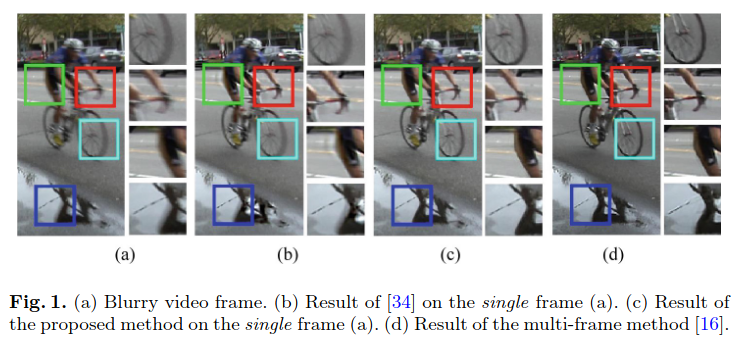

{{ page.authors }}

## Abstract

>We propose a deep learning approach to remove motion blur from a single image captured in the wild, i.e., in an uncontrolled setting. Thus, we consider motion blur degradations that are due to both camera and object motion, and by occlusion and coming into view of objects. In this scenario, a model-based approach would require a very large set of parameters, whose fitting is a challenge on its own. Hence, we take a data-driven approach and design both a novel convolutional neural network architecture and a dataset for blurry images with ground truth. The network produces directly the sharp image as output and is built into three pyramid stages, which allow to remove blur gradually from a small amount, at the lowest scale, to the full amount, at the scale of the input image. To obtain corresponding blurry and sharp image pairs, we use videos from a high frame-rate video camera. For each small video clip we select the central frame as the sharp image and use the frame average as the corresponding blurred image. Finally, to ensure that the averaging process is a sufficient approximation to real blurry images we estimate optical flow and select frames with pixel displacements smaller than a pixel. We demonstrate state of the art performance on datasets with both synthetic and real images.
## Resources

<a href=" {{ page.paperurl }} ">[pdf]</a> <a href=" {{ page.arxiv }} ">[arxiv]</a> <a href=" {{ page.code }} ">[github]</a> <a href=" {{ page.video }} ">[video]</a> <a href=" {{ page.poster }} ">[video]</a>

## Bibtex

   @inproceedings{noroozi2017motion,
  title={Motion deblurring in the wild},
  author={Noroozi, Mehdi and Chandramouli, Paramanand and Favaro, Paolo},
  booktitle={German conference on pattern recognition},
  pages={65--77},
  year={2017},
  organization={Springer}
}

