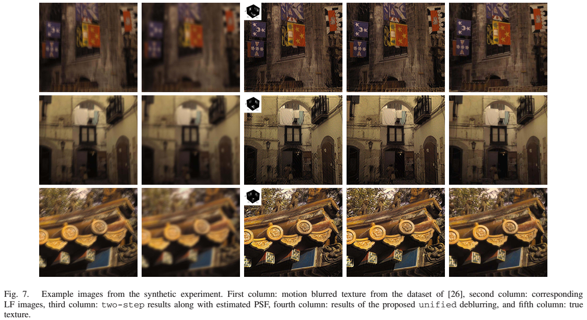

{{ page.authors }}

## Abstract

> We propose a method to remove motion blur in a single light field captured with a moving plenoptic camera. Since motion is unknown, we resort to a blind deconvolution formulation, where one aims to identify both the blur point spread function and the latent sharp image. Even in the absence of motion, light field images captured by a plenoptic camera are affected by a non-trivial combination of both aliasing and defocus, which depends on the 3D geometry of the scene. Therefore, motion deblurring algorithms designed for standard cameras are not directly applicable. Moreover, many state of the art blind deconvolution algorithms are based on iterative schemes, where blurry images are synthesized through the imaging model. However, current imaging models for plenoptic images are impractical due to their high dimensionality. We observe that plenoptic cameras introduce periodic patterns that can be exploited to obtain highly parallelizable numerical schemes to synthesize images. These schemes allow extremely efficient GPU implementations that enable the use of iterative methods. We can then cast blind deconvolution of a blurry light field image as a regularized energy minimization to recover a sharp high-resolution scene texture and the camera motion. Furthermore, the proposed formulation can handle non-uniform motion blur due to camera shake as demonstrated on both synthetic and real light field data.
## Resources

<a href=" {{ page.paperurl }} ">[pdf]</a> <a href=" {{ page.arxiv }} ">[arxiv]</a> <a href=" {{ page.code }} ">[github]</a> <a href=" {{ page.video }} ">[video]</a> <a href=" {{ page.poster }} ">[video]</a>

## Bibtex
@article{chandramouli2018plenoptic,
  title={Plenoptic Image Motion Deblurring},
  author={Chandramouli, Paramanand and Jin, Meiguang and Perrone, Daniele and Favaro, Paolo},
  journal={IEEE transactions on image processing},
  volume={27},
  number={4},
  pages={1723--1734},
  year={2018},
  publisher={IEEE}
}

