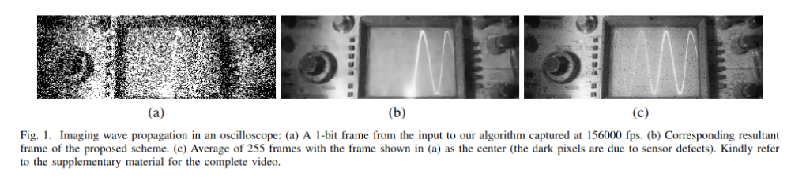

{{ page.authors }}

## Abstract

> Recent advances in photographic sensing technologies have made it possible to achieve light detection in terms of a single photon. Photon counting sensors are being increasingly used in many diverse applications. We address the problem of jointly recovering spatial and temporal scene radiance from very few photon counts. Our ConvNet-based scheme effectively combines spatial and temporal information present in measurements to reduce noise. We demonstrate that using our method one can acquire videos at a high frame rate and still achieve good quality signal-to-noise ratio. Experiments show that the proposed scheme performs quite well in different challenging scenarios while the existing approaches are unable to handle them.

## Resources

<a href=" {{ page.paperurl }} ">[pdf]</a> <a href=" {{ page.arxiv }} ">[arxiv]</a> <a href=" {{ page.code }} ">[github]</a> <a href=" {{ page.video }} ">[video]</a> <a href=" {{ page.poster }} ">[video]</a>

## Bibtex

@inproceedings{chandramouli2019bit,
  title={A bit too much? High speed imaging from sparse photon counts},
  author={Chandramouli, Paramanand and Burri, Samuel and Bruschini, Claudio and Charbon, Edoardo and Kolb, Andreas},
  booktitle={2019 IEEE International Conference on Computational Photography (ICCP)},
  pages={1--9},
  year={2019},
  organization={IEEE}
}

