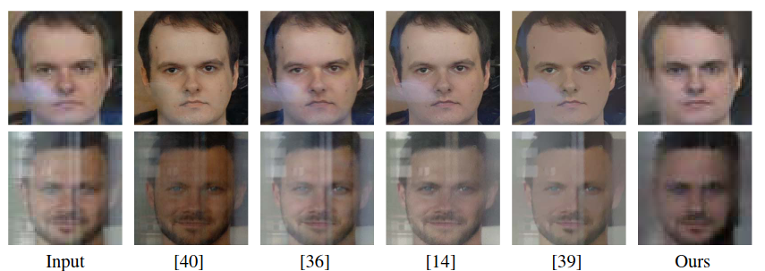

{{ page.authors }}

## Abstract

> The goal of single image reflection removal is to suppress unwanted merging of radiances from different surfaces in the scene. This is an inherently ill-posed and challenging problem. Conventional approaches use different assumptions and constraints on the background and reflected layers to solve this problem. Recently, deep learning-based approaches have been applied to this task. These methods require extensive amount of realistic data for training. In this paper, we propose to incorporate class-specific prior models for reducing the ill-posedness of the reflection separation task. Specifically, we use a pre-trained deep face-generative model for reflection supression from face images. We design an optimization scheme that effectively leverages the deep generative model and leads to a constrained solution space. Our method does not require training data corresponding to reflection separation task. We evaluate our proposed approach using both synthetic and real world facial images containing reflections and compare with existing state-of-the-art techniques. The results demonstrate advantages of our approach over the current state-of-the-art in single image reflection separation from faces.

## Resources

<a href=" {{ page.paperurl }} ">[pdf]</a> <a href=" {{ page.arxiv }} ">[arxiv]</a> <a href=" {{ page.code }} ">[github]</a> <a href=" {{ page.video }} ">[video]</a> <a href=" {{ page.poster }} ">[video]</a>

## Bibtex

@inproceedings{chandramouli2019blind,
  title={Blind single image reflection suppression for face images using deep generative priors},
  author={Chandramouli, Paramanand and Vaishnavi Gandikota, Kanchana},
  booktitle={Proceedings of the IEEE/CVF International Conference on Computer Vision Workshops},
  year={2019}
}

