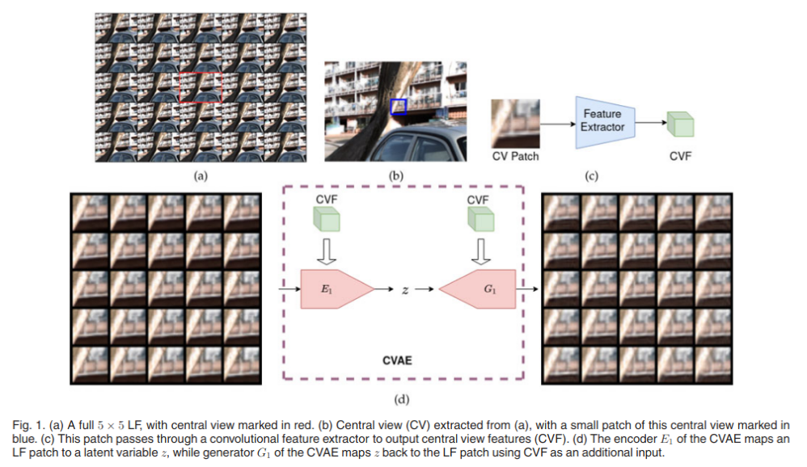

{{ page.authors }}

## Abstract

> Recently deep generative models have achieved impressive progress in modeling the distribution of training data. In this work, we present for the first time a generative model for 4D light field patches using variational autoencoders to capture the data distribution of light field patches. We develop a generative model conditioned on the central view of the light field and incorporate this as a prior in an energy minimization framework to address diverse light field reconstruction tasks. While pure learning-based approaches do achieve excellent results on each instance of such a problem, their applicability is limited to the specific observation model they have been trained on. On the contrary, our trained light field generative model can be incorporated as a prior into any model-based optimization approach and therefore extend to diverse reconstruction tasks including light field view synthesis, spatial-angular super resolution and reconstruction from coded projections. Our proposed method demonstrates good reconstruction, with performance approaching end-to-end trained networks, while outperforming traditional model-based approaches on both synthetic and real scenes. Furthermore, we show that our approach enables reliable light field recovery despite distortions in the input. 

## Resources

<a href=" {{ page.paperurl }} ">[pdf]</a> <a href=" {{ page.arxiv }} ">[arxiv]</a> <a href=" {{ page.code }} ">[github]</a> <a href=" {{ page.video }} ">[video]</a> <a href=" {{ page.poster }} ">[video]</a>

## Bibtex

@article{chandramouli2022generative,
  title={A Generative Model for Generic Light Field Reconstruction},
  author={Chandramouli, Paramanand and Gandikota, Kanchana Vaishnavi and Goerlitz, Andreas and Kolb, Andreas and Moeller, Michael},
  journal={IEEE Transactions on Pattern Analysis \& Machine Intelligence},
  volume={44},
  number={04},
  pages={1712--1724},
  year={2022},
  publisher={IEEE Computer Society}
}

