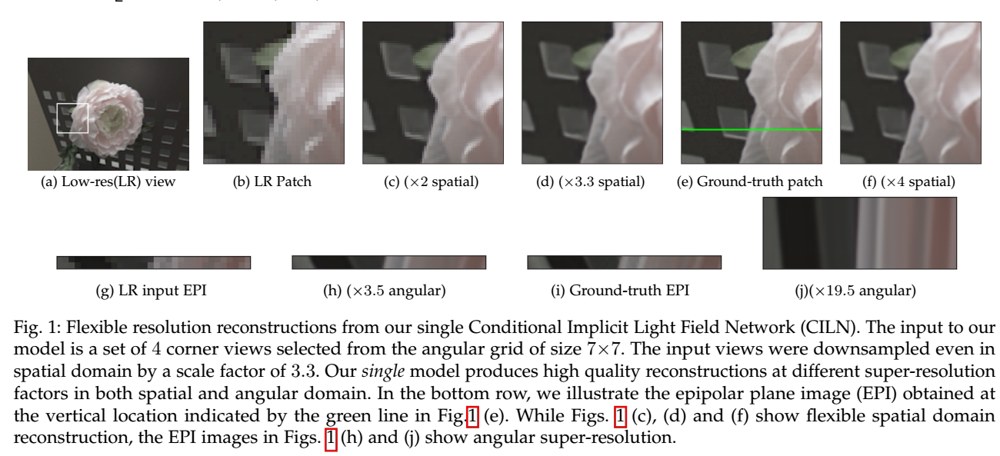

{{ page.authors }}

## Abstract

> Inspired by the recent advances in implicitly representing signals with trained neural networks, we aim to learn a continuous representation for narrow-baseline 4D light fields. We propose an implicit representation model for 4D light fields which is conditioned on a sparse set of input views. Our model is trained to output the light field values for a continuous range of query spatio-angular coordinates. Given a sparse set of input views, our scheme can super-resolve the input in both spatial and angular domains by flexible factors. consists of a feature extractor and a decoder which are trained on a dataset of light field patches. The feature extractor captures per-pixel features from the input views. These features can be resized to a desired spatial resolution and fed to the decoder along with the query coordinates. This formulation enables us to reconstruct light field views at any desired spatial and angular resolution. Additionally, our network can handle scenarios in which input views are either of low-resolution or with missing pixels. Experiments show that our method achieves state-of-the-art performance for the task of view synthesis while being computationally fast.

## Resources

<a href=" {{ page.paperurl }} ">[pdf]</a> <a href=" {{ page.arxiv }} ">[arxiv]</a> <a href=" {{ page.code }} ">[github]</a> <a href=" {{ page.video }} ">[video]</a> <a href=" {{ page.poster }} ">[video]</a>

## Bibtex

@article{chandramouli2021light,
  title={Light Field Implicit Representation for Flexible Resolution Reconstruction},
  author={Chandramouli, Paramanand and Sommerhoff, Hendrik and Kolb, Andreas},
  journal={arXiv preprint arXiv:2112.00185},
  year={2021}
}

