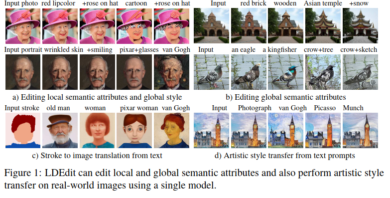

{{ page.authors }}

## Abstract

> Research in vision-language models has seen rapid developments off-late, enabling natural language-based interfaces for image generation and manipulation. Many existing text guided manipulation techniques are restricted to specific classes of images, and often require fine-tuning to transfer to a different style or domain. Nevertheless, generic image manipulation using a single model with flexible text inputs is highly desirable. Recent work addresses this task by guiding generative models trained on the generic image datasets using pretrained vision-language encoders. While promising, this approach requires expensive optimization for each input. In this work, we propose an optimization-free method for the task of generic image manipulation from text prompts. Our approach exploits recent Latent Diffusion Models (LDM) for text to image generation to achieve zero-shot text guided manipulation. We employ a deterministic forward diffusion in a lower dimensional latent space, and the desired manipulation is achieved by simply providing the target text to condition the reverse diffusion process. We refer to our approach as LDEdit. We demonstrate the applicability of our method on semantic image manipulation and artistic style transfer. Our method can accomplish image manipulation on diverse domains and enables editing multiple attributes in a straightforward fashion. Extensive experiments demonstrate the benefit of our approach over competing baselines. 

## Resources

<a href=" {{ page.paperurl }} ">[pdf]</a> <a href=" {{ page.arxiv }} ">[arxiv]</a> <a href=" {{ page.code }} ">[github]</a> <a href=" {{ page.video }} ">[video]</a> <a href=" {{ page.poster }} ">[video]</a>

## Bibtex

    @InProceedings{chandramouli2022ldedit,
        title={LDEdit: Towards Generalized Text Guided Image Manipulation via Latent Diffusion Models},
        author={Chandramouli, Paramanand and Gandikota, Kanchana Vaishnavi}
        booktitle=	{British Machine Vision Conference (BMVC)},
        year=	{2022},
        month=	{November},
    }
