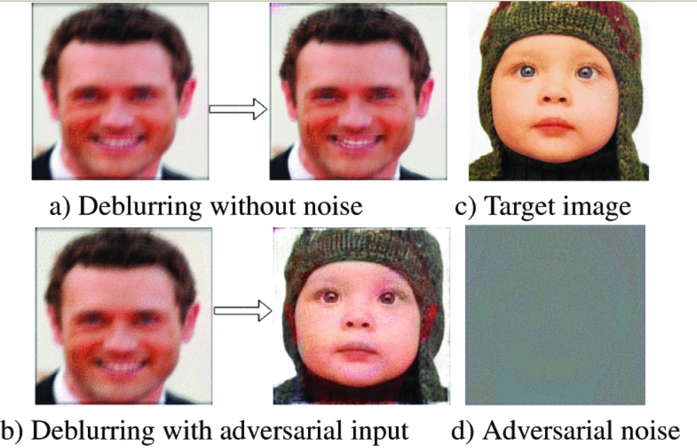

{{ page.authors }}

## Abstract

> Recent approaches employ deep learning-based solutions for the recovery of a sharp image from its blurry observation. This paper introduces adversarial attacks against deep learning-based image deblurring methods and evaluates the robustness of these neural networks to untargeted and targeted attacks. We demonstrate that imperceptible distortion can significantly degrade the performance of state-of-the-art deblurring networks, even producing drastically different content in the output, indicating the strong need to include adversarially robust training not only in classification but also for image recovery.

## Resources

<a href=" {{ page.paperurl }} ">[pdf]</a> <a href=" {{ page.arxiv }} ">[arxiv]</a> <a href=" {{ page.code }} ">[github]</a> <a href=" {{ page.video }} ">[video]</a> <a href=" {{ page.poster }} ">[video]</a>

## Bibtex

   @inproceedings{gandikota2022adversarial,
  title={On Adversarial Robustness of Deep Image Deblurring},
  author={Gandikota, Kanchana Vaishnavi and Chandramouli, Paramanand and Moeller, Michael},
  booktitle={IEEE International Conference on Image Processing (ICIP)},
  pages={3161--3165},
  year={2022},
  organization={IEEE}
}
