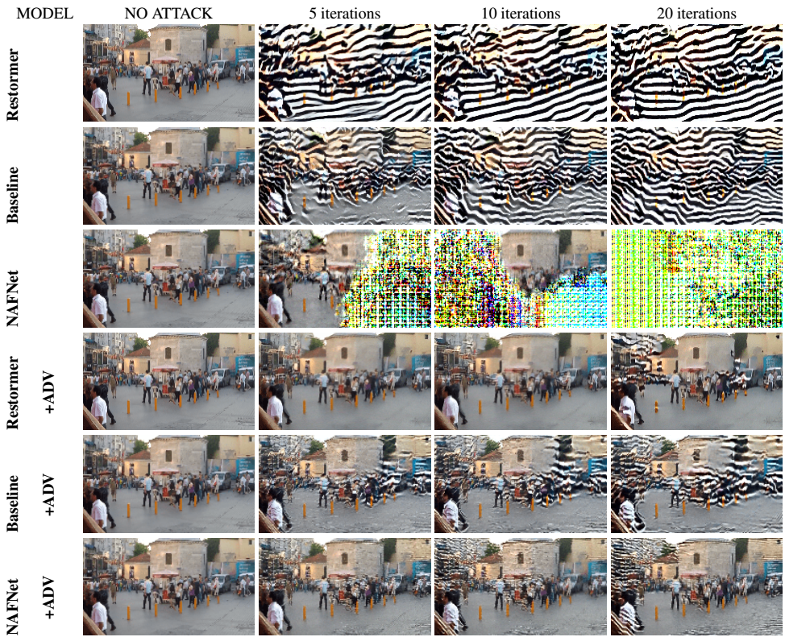

{{ page.authors }}

## Abstract

>  Following their success in visual recognition tasks, Vision Transformers(ViTs) are being increasingly employed for image restoration. As a few recent works claim that ViTs for image classification also have better robustness properties, we investigate whether the improved adversarial robustness of ViTs extends to image restoration. We consider the recently proposed Restormer model, as well as NAFNet and the "Baseline network" which are both simplified versions of a Restormer. We use Projected Gradient Descent (PGD) and CosPGD, a recently proposed adversarial attack tailored to pixel-wise prediction tasks for our robustness evaluation. Our experiments are performed on real-world images from the GoPro dataset for image deblurring. Our analysis indicates that contrary to as advocated by ViTs in image classification works, these models are highly susceptible to adversarial attacks. We attempt to improve their robustness through adversarial training. While this yields a significant increase in robustness for Restormer, results on other networks are less promising. Interestingly, the design choices in NAFNet and Baselines, which were based on iid performance, and not on robust generalization, seem to be at odds with the model robustness. Thus, we investigate this further and find a fix. 
## Resources

<a href=" {{ page.paperurl }} ">[pdf]</a> <a href=" {{ page.arxiv }} ">[arxiv]</a> <a href=" {{ page.code }} ">[github]</a> <a href=" {{ page.video }} ">[video]</a> <a href=" {{ page.poster }} ">[video]</a>

## Bibtex

@inproceedings{agnihotri2023unreasonable,
  title={On the unreasonable vulnerability of transformers for image restoration--and an easy fix},
  author={Agnihotri, Shashank and Gandikota, Kanchana Vaishnavi and Grabinski, Julia and Chandramouli, Paramanand and Keuper, Margret},
  journal={ICCV Workshops},
  year={2023}
}
