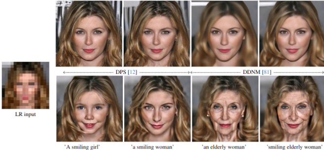

{{ page.authors }}

## Abstract

> In this paper, we introduce the problem of zero-shot text-guided exploration of the solutions to open-domain image super-resolution. Our goal is to allow users to explore diverse, semantically accurate reconstructions that preserve data consistency with the low-resolution inputs for different large downsampling factors without explicitly training for these specific degradations. We propose two approaches for zero-shot text-guided super-resolution - i) modifying the generative process of text-to-image T2I diffusion models to promote consistency with low-resolution inputs, and ii) incorporating language guidance into zero-shot diffusion-based restoration methods. We show that the proposed approaches result in diverse solutions that match the semantic meaning provided by the text prompt while preserving data consistency with the degraded inputs. We evaluate the proposed baselines for the task of extreme super-resolution and demonstrate advantages in terms of restoration quality, diversity, and explorability of solutions.
## Resources

<a href=" {{ page.paperurl }} ">[pdf]</a> <a href=" {{ page.arxiv }} ">[arxiv]</a> <a href=" {{ page.code }} ">[github]</a> <a href=" {{ page.video }} ">[video]</a> <a href=" {{ page.poster }} ">[video]</a>

## Bibtex

    @InProceedings{gandikota2024text,
        title={Text-guided Explorable Image Super-resolution},
        author={ Gandikota, Kanchana Vaishnavi and Chandramouli, Paramanand}
        booktitle=	{IEEE / CVF Computer Vision and Pattern Recognition Conference (CVPR)},
        year=	{2024},
        month=	{June},
    }
